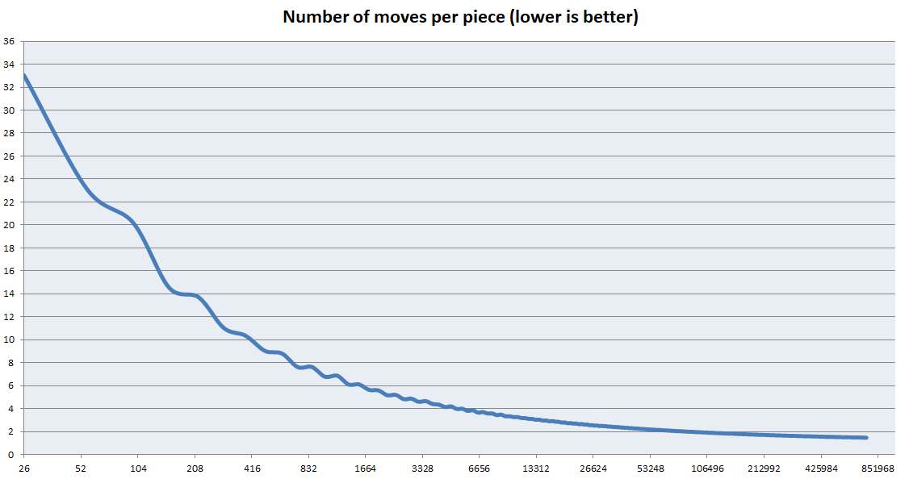

# RCube

Rubik's Cube solver for very large cubes.  

Solves any cube of any size from 1 to 65536. The code can be easily modified to handle even larger cubes. However the primary limitation is the amount of memory on a system and the length of time it takes to solve.
Solve time grows N^3 which means it takes 8 times longer to solve a cube that is 2x larger in each dimension. The number of pieces grows N^2 and the amount of work to rotate a slice is N, thus N^3;

Image of the front face of a 32768 cube: https://www.easyzoom.com/imageaccess/e5764d0e8821431388d02d1c2d481c38

# Solve Method
Solves the centers then corners then edges

The center is solved in 15 stages where each stage moves all the pieces of a certain color from one face to the desired face. For example: a stage moves all green pieces on the white face to the green face. Repeat this for all colors and faces.

The solver uses a commutator that can move many pieces simultaneously which makes it about 4 times faster on average than a simple commutator that moves one piece at a time.  
Face rotations are free.  Instead of moving all the pieces on a given face to perform a rotation, the solver simply changes the coordinate system of the face. This saves an enormous amount of data swapping. 

The corners are solved using a basic brute force method of moving the corner into place and then rotating until the faces were oriented correctly. Will Smith can explain: https://www.youtube.com/watch?v=WBzkDrC9vQs

The edges are solved by moving every pair of edges to the front face, then swapping desired pieces from the left edge to the right edge. A lot of functions where needed to fix or prevent parity issues.

# Image Export

https://www.nayuki.io/page/tiny-png-output

https://github.com/nayuki/Nayuki-web-published-code

Tiny PNG Output is a small standalone library, available in C and C++, which takes RGB8.8.8 pixels and writes a PNG file.

# Efficiency 
This algorithm is optimized for very large cubes. However it is terrible for small cubes. There are much much better algorithms for small cubes.

