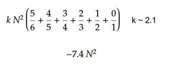

# RCube

Rubik's Cube solver for very large cubes.  

Solves any cube of any size from 1 to 65536. The code can be easily modified to handle even larger cubes. However the primary limitation is the amount of memory on a system and the length of time it takes to solve.
Solve time grows N^3 which means it takes 8 times longer to solve a cube that is 2x larger in each dimension. The number of pieces grows N^2 and the amount of work to rotate a slice is N, thus N^3;

[Image of the front face of a 32768 cube](https://www.easyzoom.com/image/146053)

## Solve Method
Solves the centers then corners then edges

### Centers
The centers are solved in 15 stages where each stage moves all the pieces of a certain color from one face to the desired face. For example: a stage moves all green pieces on the white face to the green face. Repeat this for all colors and faces.

The solver uses the commutator described [here](https://www.jaapsch.net/puzzles/cube7.htm) which can commute center pieces from one quadrant of a face to a quandrant on another face. A very important property of this commutator is that can be modified move many pieces in single row at the same time. For very large cubes this means it can move hundreds if not thousands of pieces in a single operation. The average number of moves k = (2 * P + 5) / P where P is the number of pieces that can be moved per operation. K quickly approaches 2 as the cube size increases.

### Corners
The corners are solved using a basic brute force method of moving the corner into place and then rotating until the faces were oriented correctly. Will Smith can explain: https://www.youtube.com/watch?v=WBzkDrC9vQs

### Edges
The edges are solved by moving every pair of edges to the front face, then swapping desired pieces from the left edge to the right edge. A number of functions where needed to fix or prevent parity issues. 

### Face Rotation Optomization
Face rotations are essentially free.  Instead of moving all the pieces on a given face (N^2 pieces) to perform a rotation, the solver simply changes the coordinate system that is uses to read/write to the face.  This saves an enormous amount of data swapping. 

```c++
//Gets the value of this face at coordinates r = row, c = column
inline const byte Face::GetRC(const uint r, const uint c) const
{
	switch (orientation) {
	case 0:
		return data[(r << BS) + c];
	case 1:
		return data[(c << BS) + (R1 - r)];
	case 2:
		return data[(((R1 - r) << BS) + (R1 - c))];
	case 3:
		return data[((R1 - c) << BS) + r];
	default:
		return 0;
	}
}
```

## Image Export
This code includes a simple image exporter that is used render each face into an image. 

https://www.nayuki.io/page/tiny-png-output

https://github.com/nayuki/Nayuki-web-published-code

Tiny PNG Output is a small standalone library, available in C and C++, which takes RGB8.8.8 pixels and writes a PNG file.

## Total Move Estimation
The total number of moves can be estimated using a simple formula. Assuming the cube is sufficiently randomized, we can expect the first face to be 1/6 solved and therefore 5/6 of the pieces will have to be moved. The second face will be 1/5 solved and require 4/5 of the pieces to be moved. The third face 3/4, Fourth face 2/3, Fifth face 1/2 and the last face will be completely solved. The average number of moves (k) to move single piece can be estimated experimentally as ~2.1. The value of k decreases as the size of the cube increases. The value can never be less than 2 since the commutator requires each piece to be moved at least 2 times.



## Efficiency 
This algorithm is optimized for very large cubes. However it is terrible for small cubes. The primary optimizations were focused on solving the centers as fast as possible and no consideration was given to solving the edges. However the size of the edges are insignificant compared to the centers as the cube size increases. The graph below shows how the average number of moves per piece decreases with larger cubes. *Note: this is not a graph of k. It is a graph of (Total Moves) / (Number of Pieces)*


